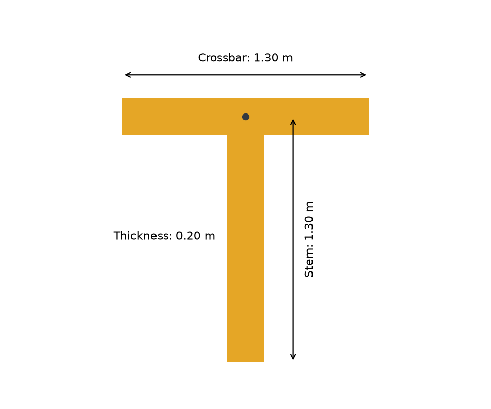
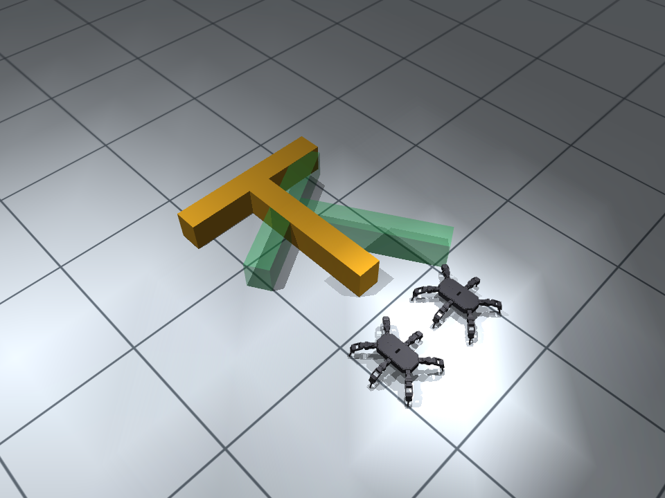

# Hexapod Transport RL

**六足ロボットによる協調物資運搬を強化学習で調べる**卒業研究向け教材です。
2台が脚・足でT字物体を押し、目標の位置・向きに合わせて静止する上位方策を、TorchRLのMAPPOで学習します。
歩行モデルは固定し、押す・回転・停止の指令をランダムな重みから報酬だけで学びます。デモは教師に使いません。

## Google Colabで始める

[](https://colab.research.google.com/github/hashimoto-robotics-lab/hexapod-transport-rl/blob/main/notebooks/hexapod_transport_rl_colab.ipynb)

Googleアカウントでログインし、上から順に実行します。GitHubの認証は不要です。
「ランタイム → ランタイムのタイプを変更」で **T4 GPU** を選んでください。
GPUではMuJoCo Warpで物理・固定歩行モデル・MAPPOを実行します。GPUがない場合はCPUへ切り替えます。
最初の実行はGPUカーネルのコンパイルが必要です。
コード・機体形状・歩行モデル・参考モデルは公開リポジトリから取得します。

最初に学習済み歩行モデルへ速度指令を送り、GymnasiumのAPIを確認します。
続いて報酬係数を1つ変更し、同じ初期重み・学習量・評価seedで2条件を比較します。
学習前後とルールベースの成功率・最終精度・接触・動画を評価し、結果をZIPで保存します。
セルは普通のPythonで、TorchRLの収集・GAE・ミニバッチ更新を直接読めます。動画はmediapyで表示します。

## 今回の課題

Tを構成する**横棒と縦棒の中心線が同じ長さ**です。
2台用では両方1.3 m、棒の太さは0.20 mです。交点を位置の基準にし、物理物体と目標の形状を一致させます。
ロボットの色は元の機体と同じで、床はグリッド付きです。胴体への押し具は追加しません。



初期配置は **T → ゴール → ロボット** です。ロボットはTの方を向き、押す側へ回り込む動作も学習します。
2台用ではTの交点から約1.85 mの位置に開始し、制限時間を40秒にしています。



短距離の0.3〜0.4 m、目標との角度差±5〜30度を扱います。
開始位置はゴール側に揃え、成功する角度と静止時間を段階的に**位置8 cm・角度5度・1秒静止**へ厳しくします。
移動するTの速度も観測し、左右の押し方と目標付近の減速・停止を学びます。
評価では学習の到達段階にかかわらず、全条件に同じ最終精度を使います。

```python
import gymnasium as gym
import numpy as np
import hexapod_transport_rl
from hexapod_transport_rl import PosePushConfig

env = gym.make("HexapodPosePush-v0", config=PosePushConfig())
observation, info = env.reset(seed=42)
action = np.zeros(env.action_space.shape, dtype=np.float32)
observation, reward, terminated, truncated, info = env.step(action)
print(info["reward_terms"])
env.close()
```

2台では観測`(2,22)`、行動`(2,3)`です。右側の観測・行動の左右と旋回を反転し、actorを共有します。
criticは全機の観測を使い、報酬はチーム全体で1つです。機体別の確率比をclipします。
参考モデル`checkpoints/pose_transport.pt`は等長3腕・T近傍開始の旧課題で学習したものです。
現在の等長2棒・ゴール側開始の学習実績とは区別します。
学生の学習には参考モデルの重みや行動を渡しません。

前進だけのルールと、位置・角度の誤差に応じて左右の速度を変える比例制御も評価します。
ルールは比較専用で、強化学習が必ず優れるとは仮定しません。

GPUでは256世界・horizon 64・3,145,728チームステップ／条件を使います。
開始位置を背後から45度ずつゴール側へ移す5段階と、精密運搬・静止の2段階で学びます。
各軸の速度を7候補（停止を含む）からMAPPOが選び、指令の確率を学びます。
Tを通り抜ける近道を接近の改善として評価せず、位置のズレが残る時間を報酬に含め、角度の追加コストは比較実験で調べます。
最終評価は学習・検証に使わない配置で行い、CPU MuJoCoでも動作を確認します。

改善後は未使用50配置で **44/50成功（88%）**、CPU MuJoCoとWarpで同じ成功数でした。
CPU評価の平均最終誤差は **5.6 cm・2.1度**、成功時の平均所要時間は19.9秒です。
学習はローカルRTX A6000で **30.1分／条件**。これはColab/T4の実測ではなく、試行錯誤の総時間も含みません。
教師デモ・旧運搬モデルを使わず、最終精度・制限40秒を緩めずに確認しました。

| 未使用50配置・CPU評価 | 成功 |
|---|---|
| 学習前 | 0/50 |
| 前進のみ / 姿勢比例制御 | 各0/50 |
| 改善したMAPPO | 44/50 |

比較した2つの単純なルールから、最適化した経路制御より優れるとは結論しません。
失敗6件と、途中で胴体にも接触した14件を含めて集計しています。胴体の力積は全接触力積の約1.7%でした。
この結果は1つの学習seedです。[全試行・設定・実測](docs/results/goal_side_improved_20261008.json)と[課題の説明](docs/pose-task.md)に記録します。
新しい参考モデルは `checkpoints/goal_side_pose.pt` です。学生はこの重みを学習の初期値に使いません。

[25 fpsの回り込み・運搬動画](docs/figures/goal_side_learned_25fps.mp4)は開発用配置の成功例です。
卒論では学習seedを少なくとも3種類、評価を50試行以上へ増やし、ばらつきも報告します。

## 読む場所

- [APIガイド](docs/api.md)：歩行指令、観測、行動、成功判定、評価。
- [Colabガイド](docs/colab-guide.md)：実験条件・保存・再開。
- [GPUと学習時間](docs/warp-training.md)：MuJoCo Warpの構成・設定・実測。
- [コードガイド](docs/code-guide.md)：環境・報酬・TorchRLの接続を読む順番。

歩行APIは1〜4台、押すAPIは2〜4台です。運搬の実学習は2台で検証します。
4台の運搬性能や障害物回避は追加実験が必要です。
位置・姿勢はシミュレータから取得します。現実の認識・通信誤差を含む実験ではありません。

## ローカルで使う

Python 3.12〜3.13とuvを使います。機体と歩行モデルはパッケージに同梱しています。

```bash
git clone https://github.com/hashimoto-robotics-lab/hexapod-transport-rl.git
cd hexapod-transport-rl
uv sync --locked
MUJOCO_GL=egl uv run pytest -q
```

ノートブックと同じPython APIが使えます。ローカルで描画する場合はEGL、Colabでは準備セルがGPU用のEGL、GPUなしならOSMesaを設定します。
`uv sync --locked`はローカル確認用のCPU版PyTorchを使います。Colabの準備セルはこのCPU指定を使わず、インストール済みのCUDA対応PyTorchを維持し、Warp依存もインストールします。
ローカルGPUで使う場合は `uv pip install --python <CUDA版Python> --no-sources -e ".[warp]"` を実行します。

以前の`transport.pt`・`pusher.pt`・`lesson_transport.pt`は、旧形状のTで学習した歴史的なモデルです。
旧モデルの再生は旧形状を明示して保持し、新しいTでの性能として扱いません。
旧CLIの`./run.sh eval --checkpoint checkpoints/transport.pt --episodes 1 --seed 70000`は引き続き利用できます。
以前の整列のみの短時間実験は[旧実験記録](docs/training-time.md)にあります。
機体資産の出典は`src/hexapod_transport_rl/assets/manifest.json`、運搬モデルは`checkpoints/manifest.json`に記録します。
