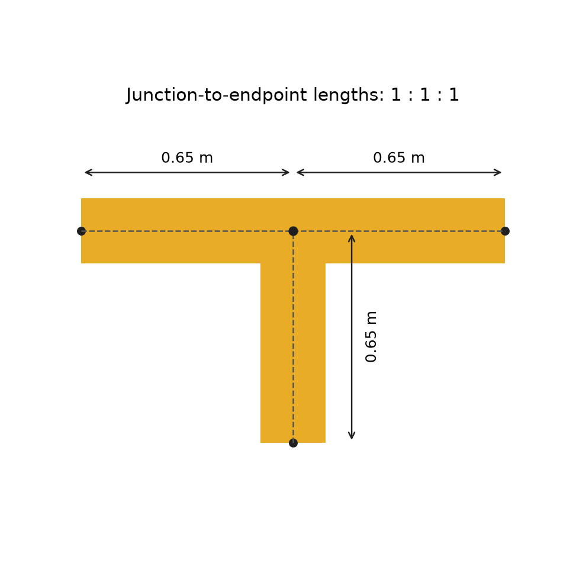
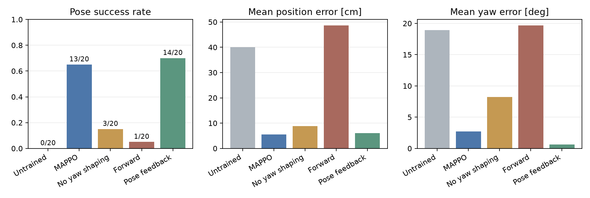

# 等長Tの回転・精密停止を学ぶ課題

2台が脚・足でTを押し、交点の位置と目標姿勢を合わせて静止します。歩行モデルだけを固定し、押す方策はランダムな重みからTorchRL MAPPOで新しく学習します。整列の旧モデルや押す旧モデル、ルールの行動・デモを学習へ渡しません。

## Tの形状と目標

Tの原点は中心線の交点です。交点から左右端・縦棒の端までの長さをすべて0.65 mにし、太さは0.20 mにしました。横棒と縦棒を重複しない箱2つで作り、面積に比例して質量を配分します。目標表示も同じ形状です。4台の設定では幅に合わせて各腕1.3 mとなります。

2台の最終目標はT基準で前方0.4 m・横方向±0.08 m、向きの差±5〜30度です。全体の向き、機体の位置±4 cm・向き±0.12 radもランダム化します。
成功には交点の位置誤差8 cm未満・向き5度未満・T速度0.06 m/s未満・角速度0.1 rad/s未満を1秒維持することを要求します。表示を合わせるために物理状態をスナップする処理はありません。

## 短時間で精度を学ぶ構成

機体をTの近くへresetし、長い回り込みに費やす物理計算を減らします。初期配置だけの指定で、学習中にTへ外力を加えるものではありません。
最初から位置8 cmの精度を使い、回転角度と静止時間を段階的に難しくします。粗い位置合わせを長く学んでから直す時間を減らすためです。

| 段階 | 距離 | 初期角度差 | 成功精度 |
|---|---:|---:|---|
| rotate | 0.3 m | ±5〜15度 | 8 cm・8度・0.6秒 |
| transport | 0.4 m | ±5〜30度 | 8 cm・5度・0.6秒 |
| settle | 0.4 m | ±5〜30度 | 8 cm・5度・1秒 |

検証は別seedで6試行、25ロールアウトごとに行います。短い予算でも後半の課題を経験できるよう、
難度移行の閾値は3/6成功とします。これは最終性能の合格基準ではありません。50%以上かつ現在の段階で25ロールアウト以上なら、次のresetから難度を上げます。進行中のエピソードは変えません。
検証経験はPPOへ渡しません。報酬によって到達段階や学習した配置が違うことは記録します。

報酬は位置・角度・押す位置のpotential-based補助報酬に、位置誤差が残る時間・接触・指令変化へのペナルティ、成功・失敗を組み合わせます。補助報酬の割引率はMAPPOと同じ0.99です。
残った位置誤差のペナルティ係数は8です。停止のペナルティは成功許容範囲の内側に十分近づいたときに強く効くようにしました。
TorchRLの価値正規化でcriticの更新尺度を揃え、PPO更新後に探索ノイズの上限を
約0.37から0.05へ徐々に下げます。行動の平均はランダムな初期重みからactorが学びます。

途中の試行では、緩い位置精度から始めると目標の約10 cm手前に停止する失敗が多く、位置8 cmの条件で成功を維持できませんでした。最初から位置精度を学び、残った位置誤差へのペナルティを加える構成へ変更しました。この探索に使ったseedは最終評価から分けています。

## 評価

同じ学習量の最後のモデルを、共通の未使用seedで評価します。角度の補助報酬の有無を比較し、角度を含む成功条件は両方に残します。全条件に最終精度・制限12秒を使います。
前進だけの制御と、位置・角度から各機の速度を調整する比例制御も比較します。ルールは評価専用で、重みや軌跡を学習へ渡しません。

成功率に加え、交点の位置・角度・Tの3端のRMS誤差、成功時の時間、機体同士の接触、胴体とTの接触、転倒を記録します。
位置と姿勢を完全に一致させる制御を達成したという意味ではありません。成功した場合も最終誤差を併記します。

## 実行記録

標準設定は65,536チームステップ／条件、2世界並列、horizon 128、ミニバッチ128、4 epochs、学習率3e-4です。
同梱の参考モデルは難度移行の閾値75%で学習し、7.45分でした。角度の補助報酬なしは8.64分です。
初期重み・学習seed 20261010・学習量・設定を揃えた比較です。最終段階まで到達しなくても、評価には最終の8 cm・5度・1秒を使います。
参考モデルはtransport段階、角度報酬なしはrotate段階で終了しました。
学生用の標準設定では移行閾値を50%にし、短い予算で後半の課題をより早く経験させます。参考モデルと自分の学習結果は区別してください。

未使用の20配置（seed 84000〜84019）での結果です。モデル・設定はこのテスト結果から選び直していません。

| 制御 | 成功 | 平均位置誤差 | 平均角度誤差 | 胴体接触の試行 | 機体同士の接触の試行 |
|---|---:|---:|---:|---:|---:|
| 学習前 | 0/20 | 40.01 cm | 18.94度 | 0 | 0 |
| MAPPO・参考モデル | 13/20 | 5.57 cm | 2.69度 | 3 | 0 |
| 角度補助報酬なし | 3/20 | 8.78 cm | 8.22度 | 0 | 20 |
| 前進だけ | 1/20 | 48.58 cm | 19.65度 | 0 | 0 |
| 比例制御 | 14/20 | 6.01 cm | 0.61度 | 0 | 0 |

転倒は全条件で0回でした。比例制御の成功率70%に対してMAPPOは65%で、今回の結果から強化学習の優位性は主張できません。
角度の補助報酬を除くと接触や残る誤差も変わっており、報酬設計を比較する教材の出発点として使います。

[全試行・条件・実測・SHA256](results/pose_task_20261007.json)と、[参考モデルの学習ログ](results/pose_annealed_20261007_progress.csv)・[角度補助報酬なしのログ](results/pose_annealed_no_orientation_20261007_progress.csv)を保存しました。

[説明用の成功動画](figures/pose_reference.mp4)はseed 87004です。参考用12配置から成功かつ胴体接触なしの中で初期角度が最大のものを選び、性能集計には使っていません。
初期角度差24.64度から、4.4秒で位置5.10 cm・角度2.03度となり、1秒の低速条件を満たしました。
目標へスナップしたり、動画のためにTへ外力を加えたりしていません。

GoogleホストのColabは実測していません。ローカルの2コア制限で時間を測り、教材のCSVにも速度と経過時間を残します。
現在のノートブックは利用可能なGPUをMAPPO更新に使います。上記の参考モデルのCPU実験と、[GPU対応後の時間測定](gpu-training.md)を区別してください。

卒論では学習seedを少なくとも3種類、未使用配置を50試行以上へ増やして、平均とばらつきを報告してください。4台の運搬性能・障害物・認識誤差は追加実験で確認します。

## 学生用ノートブックの通し実行

ローカルのJupyterカーネルで全16コードセルを実行し、9本のmediapy動画、評価CSV、結果ZIP、移動後のモデル読み込みを確認しました。全体で20.24分です。
Python 3.12.13・NumPy 2.0.2・PyTorch 2.11.0 CPUを読み込み済みのカーネルへインストールし、別プロセスへ学習を逃がさずに実行しました。CPUは2コア・描画はOSMesaです。Git取得は編集済み全ファイルのローカルfixtureを用いました。GoogleホストのColab実行ではありません。

各条件を65,536チームステップ、難度移行50%で学習しました。参考モデルとは別の実行です。

| 条件 | 学習時間 | 到達段階 | 成功（12配置） | 平均位置誤差 | 平均角度誤差 |
|---|---:|---|---:|---:|---:|
| baseline | 7.15分 | settle | 8/12 | 7.62 cm | 2.00度 |
| no_orientation | 7.29分 | transport | 3/12 | 14.38 cm | 1.02度 |

この通し実行での前進ルールは1/12、比例制御は10/12成功しました。比較図も[保存しています](figures/pose_colab_comparison.png)。
最終モデルを共通の最終精度で評価しています。1つの学習seedの結果で、別seedや4台へ性能を保証するものではありません。
