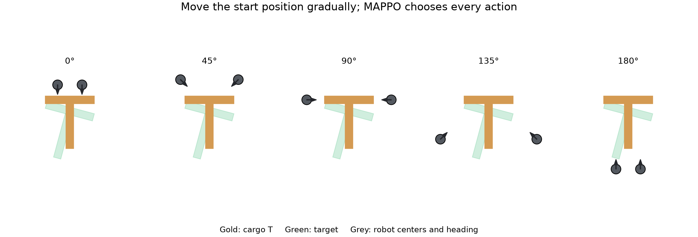
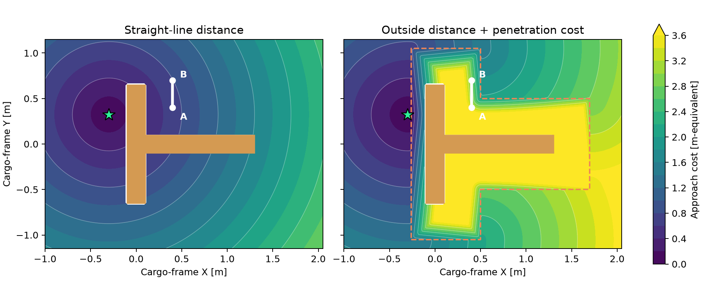
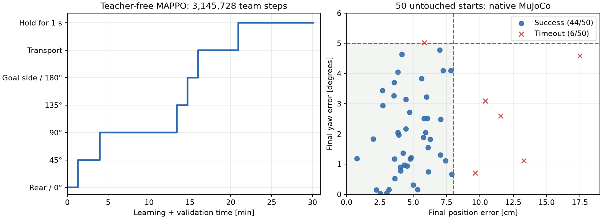

# 等長2棒のT：回り込み・回転・精密停止を学ぶ課題

2台が脚・足でTを押し、交点の位置と目標姿勢を合わせて静止します。歩行モデルを固定し、押す方策はTorchRL MAPPOで学習します。共通モデルはランダムな重みから報酬だけで学びました。学生用Colabは同じ共通モデルから報酬を変えて追加学習します。整列の旧モデルや押す旧モデル、ルールの行動・デモを学習へ渡しません。

## Tの形状と目標

Tの原点は中心線の交点です。横棒の全長と縦棒の長さをともに1.3 m、太さを0.20 mにします。
横棒と縦棒を重複しない箱2つで作り、面積に比例して質量を配分します。目標表示も同じ形状です。
4台では両方2.6 mです。旧形状 `equal_arms` は以前のcheckpointの再生用に残します。

2台の最終目標はT基準で前方0.4 m・横方向±0.08 m、向きの差±5〜30度です。全体の向き、機体の位置±4 cm・向き±0.12 radもランダム化します。
成功には交点の位置誤差8 cm未満・向き5度未満・T速度0.06 m/s未満・角速度0.1 rad/s未満を1秒維持することを要求します。表示を合わせるために物理状態をスナップする処理はありません。

## 開始配置と学習

初期配置は **T→ゴール→ロボット** です。ロボットはTを向き、Tの縦棒長とゴール距離の大きい方に0.55 mを加えた位置から開始します。
2台では交点から約1.85 mです。全体の向きが変わってもゴールへの方向を基準に並べます。
Tの後ろへ回り込み、押し始める過程も学習対象で、エピソードは40秒にします。
初期配置だけの指定で、学習中にTへ外力を加えたり、経路や行動の教師値を与えたりしません。

開始位置をTの背後から45度ずつ移し、押す技能を保ちながら回り込みを広げます。
最終評価は常にゴール側開始です。近傍開始の学習成功を最終性能として扱いません。

| 段階 | 開始位置 | 距離・初期角度差 | 成功精度 |
|---|---|---|---|
| approach_0 | 背後・近く | 0.3 m・±5〜15度 | 8 cm・8度・0.6秒 |
| approach_45 / 90 / 135 | 側方からゴール側へ | 同上 | 同上 |
| approach_180 | T→ゴール→ロボット | 同上 | 同上 |
| transport | 同上 | 0.4 m・±5〜30度 | 8 cm・5度・0.6秒 |
| settle | 同上 | 同上 | 8 cm・5度・1秒 |

別seedの6配置を8ロールアウトごとに検証し、3/6成功かつ現在の段階で8ロールアウト以上なら進みます。
検証は独立したGPU環境で行い、経験をPPOへ渡しません。難度変更は次のresetにだけ適用します。

観測と上位行動はTの座標系で揃えます。行動を各機の向きに応じて歩行モデルの機体座標へ変換し、指令範囲へ制限します。
これは座標変換で、経路や速度をルールで選ぶ処理ではありません。

T基準の指令倍率はXYとも0.2 m/s、旋回0.6 rad/sです。変換後の機体指令は元の歩行範囲へ制限します。
MAPPOのactorは各軸の`[-1, -0.5, -0.25, 0, 0.25, 0.5, 1]`から選ぶ確率を学びます。
評価では各軸の確率最大の候補を選びます。停止も明示的な候補なので、左右の指令を平均した小さな速度で止まることを避けます。
これは状態によらない行動空間であり、回り込みの指令や経路は与えません。

報酬は位置・角度・接近のpotential-based補助報酬に、残る誤差・押す向き・接触・指令変化のコスト、成功・失敗を組み合わせます。
補助報酬の割引率はMAPPOと同じ0.995です。価値正規化でcriticの更新尺度を揃えます。

接近を直線距離だけで評価すると、Tを通り抜ける方向に動いて停滞します。
標準ではTの前方・側方に脚の広がりを考慮した0.4 mの余裕を設け、外側を通る距離を評価します。
余裕領域の内側では食い込み距離を10倍して、外側へ出てから押す位置までの距離に足します。
複数の出口の最小コストを使うため、出口の切り替わりで不連続な「改善」が生じることも避けます。
後方は脚を当てられるよう余裕を小さくします。これは状態の報酬用コストで、actorへ経路や行動を渡しません。

`orientation_error` は角度のズレが残る時間を評価する追加コストです。標準は0とし、増やすと改善するかを比較します。強いペナルティが学習を難しくする場合もあります。
`approach_error` は押す位置から離れたままの時間を、`push_heading` はTの背後で押す向きと違う姿勢を評価します。
成功50・転倒等−500とし、残る誤差のコストを避けるために早期失敗する動作を有利にしません。
最終精度・制限時間は報酬の変更で緩めません。

## 評価

同じ学習量の最後のモデルを、共通の未使用seedで評価します。角度のズレが残る時間のコストだけを有無で比較し、角度を含む成功条件は両方に残します。全条件に最終精度・制限40秒を使います。
前進だけの制御と、位置・角度から各機の速度を調整する比例制御も比較します。ルールは評価専用で、重みや軌跡を学習へ渡しません。

成功率に加え、交点の位置・角度・Tの3端のRMS誤差、成功時の時間、機体同士の接触、胴体とTの接触、転倒を記録します。
位置と姿勢を完全に一致させる制御を達成したという意味ではありません。成功した場合も最終誤差を併記します。

## 改善後の実測

ランダムな初期重みから3,145,728チームステップを学習し、ローカルRTX A6000で30.1分でした。
256世界・horizon 64、TorchRL MAPPO、7段階のカリキュラムを使っています。
学習時間は収集・更新・検証を含み、初期化・最終評価・録画・以前の試行錯誤を含みません。Colab/T4の実測ではありません。

設定の選択に使った開発seedは86000〜86011、段階の検証は62000から段階ごとに1000を加えた6配置です。
最終モデルと設定を固定してから、未使用seed88000〜88049の50配置を評価しました。最終テストからモデルを選び直していません。

| 最終50配置・通常のMuJoCo | 成功 | 平均位置誤差 | 平均角度誤差 |
|---|---|---|---|
| 学習前 | 0/50 | 40.2 cm | 18.0度 |
| 前進のみ | 0/50 | 347.9 cm | 83.6度 |
| 姿勢比例制御 | 0/50 | 442.5 cm | 23.0度 |
| 改善したMAPPO | **44/50** | **5.6 cm** | **2.1度** |

Warpで同じ初期状態から独立して評価した結果も44/50、平均5.7 cm・2.7度でした。
CPUとWarpで成功した配置・軌跡は完全には一致しません。平均誤差は失敗例も含みます。
CPUの成功時の平均所要時間は19.9秒でした。6件の失敗は時間切れで、転倒はありませんでした。
成功率88%のWilson 95%区間は約76〜94%ですが、これは評価配置のばらつきで、学習seed間のばらつきではありません。

胴体にも一時的に接触した配置が14/50、機体同士の接触が3/50あります。
胴体の法線力積は全接触力積の約1.7%で、両機の脚リンクの力積は49/50、両機の足の力積は48/50で正でした。
脚・足だけの接触を全試行で保証した結果ではありません。胴体接触の抑制は追加の研究課題です。
押し具やTへの外力、物理状態のスナップは使っていません。

[約17度の成功動画](figures/goal_side_learned_25fps.mp4)と[約28度の成功動画](figures/goal_side_turning_25fps.mp4)は開発用配置の例です。
両方とも胴体・機体同士の接触はなく、25 fpsの実際の物理状態です。動画を学習の教師に使っていません。
前者の最終誤差は位置4.4 cm・角度1.0度、後者は0.8 cm・4.9度です。

[全設定・全試行・モデルSHA256](results/goal_side_improved_20261008.json)と[学習CSV](results/goal_side_improved_20261008_progress.csv)を残しています。
[API・GPU更新・notebookセル・録画の検証記録](results/goal_side_improved_20261008_verification.json)もあります。
`checkpoints/goal_side_pose.pt`がこの課題の参考モデルです。学生用の短時間比較では全条件の共通初期値に使います。ランダムな重みからの学習は別ノートブックで再現します。
比較した2つの単純なルールの結果だけで、経路計画を備えた最適化済みの制御器への優位性は結論しません。

## 開発と以前の記録

初回の新配置学習は131,072ステップ・169.35秒で、CPU/GPUとも0/12成功でした。
脚・足の接触もなく、回り込みを獲得していません。[全設定・全試行](results/goal_side_training_20261008.json)と[ログ](results/goal_side_training_20261008_progress.csv)を残しています。
その後、開発seedで接近コスト・姿勢・指令・探索量を調べました。
同じ3,145,728ステップの連続行動モデルは開発配置5/12、角度の時間コストを4にした連続行動モデルは0/12、
採用した速度選択モデルは11/12でした。行動分布とXYの指令倍率を合わせて変更した比較で、各要因を分離した検証ではありません。
角度のペナルティを増やせば必ず改善するとは限らず、学生用notebookでも1係数だけ変えて比較します。

採用設定について、初期actor・criticの重みが完全に同じで、`orientation_error`だけ0→4とする実学習も行いました。
同じ3,145,728ステップ後、角度コストを強くした条件は最終50配置で4/50成功、平均位置46.2 cm・角度14.9度でした。
ゴール側開始の接近段階に留まり、標準のように精密静止へ進めませんでした。学習時間は42.1分です。
これは1つの学習seedで、追加コストが一般に悪いという結論ではありません。報酬によって経験する配置も変わるため、到達段階と精度を併記します。
初期重みの一致・全設定・全試行は[同じ結果JSON](results/goal_side_improved_20261008.json)、
段階の推移は[比較条件のCSV](results/goal_side_improved_20261008_orientation_cost_progress.csv)にあります。

等長3腕・T近傍開始・制限12秒の旧課題は、現在の結果と区別します。
[旧CPU学習の全試行](results/pose_task_20261007.json)ではMAPPO 13/20、比例制御14/20でした。
[旧Warp学習](results/warp_training_20261008.json)ではCPU 7/12・GPU 8/12です。
旧課題でも強化学習の優位性を示した結果ではありません。
旧checkpointは保存設定・形状・機体座標の行動を復元して再生します。

卒論では学習seedを少なくとも3種類、未使用配置を50試行以上へ増やして平均とばらつきを報告してください。
4台の運搬性能・障害物・認識誤差は追加実験で確認します。位置・姿勢はシミュレータから直接取得する条件です。
