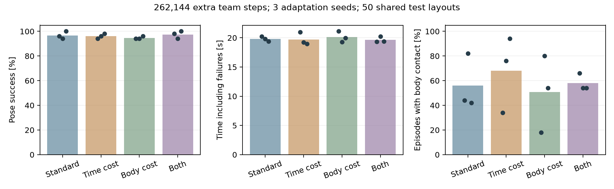

# 短時間で報酬の組み合わせを比較する

[学生用Colab](https://colab.research.google.com/github/hashimoto-robotics-lab/hexapod-transport-rl/blob/main/notebooks/hexapod_transport_rl_colab.ipynb)は、共通のRL学習済みモデルから報酬を変えて追加学習する教材です。
毎回の回り込み獲得を省き、学生が報酬の仮説・比較・評価へ時間を使えるようにしました。
教師デモ・行動ラベル・模倣損失は使いません。全行動をMAPPOが選びます。

## 何を速くしたか

- 物理・歩行・経験収集・MAPPOをGPU内で実行し、1024世界を並列化する。
- horizonは64（各世界12.8秒）を保ち、ミニバッチを1024へ増やす。
- 全条件を同じ共通モデルから262,144チームステップだけ追加学習する。
- 最終課題を固定し、段階移行の検証・描画を学習ループから外す。
- 学習方策の配置別評価もGPUで並列化し、録画は比較する2条件に絞る。

新規学習のコストはなくなりません。共通モデルはランダムな重みから3,145,728チームステップ、
ローカルRTX A6000で30.1分学びました。これは1つの事前学習seedです。
この教材で研究するのは**報酬変更後の適応**です。新規学習の速さや、報酬だけから最初に獲得する行動とは区別します。
[ランダムな重みからの新規学習Colab](https://colab.research.google.com/github/hashimoto-robotics-lab/hexapod-transport-rl/blob/main/notebooks/hexapod_transport_rl_from_scratch.ipynb)も残しています。

## 実験の結果

時間コスト0.02→0.5、胴体接触コスト6→60の2×2比較を、追加学習seed `20261020 / 21 / 22` で実行しました。
actor・critic・価値統計は全12回で共通モデルと完全一致する初期値、Adamは毎回新規です。
同じ初期重みであることをテンソル比較で確認しました。物理・成功条件・予算は共通です。
最後の固定予算モデルをすべて評価し、最良seedだけを選びません。

開発配置は `91000..91023`。4条件・学習量を固定してから、新しい `94000..94049` を最終評価しました。
T→ゴール→ロボット、等長2棒のT、2台、制限40秒、位置8 cm・角度5度・低速1秒です。
精度・初期配置を緩めて速度を出したものではありません。

| 条件 | 追加学習の平均時間 | CPU成功数 | Warp成功数 | 失敗込み所要時間・CPU | 胴体接触のある試行・CPU |
|---|---:|---:|---:|---:|---:|
| 標準 | 41.7秒 | 145/150（96.7%） | 145/150（96.7%） | 19.82秒 | 56.0% |
| 時間コスト | 41.5秒 | 144/150（96.0%） | 142/150（94.7%） | 19.72秒 | 68.0% |
| 胴体接触コスト | 41.7秒 | 142/150（94.7%） | 139/150（92.7%） | 20.11秒 | 50.7% |
| 両方 | 42.0秒 | 146/150（97.3%） | 143/150（95.3%） | 19.65秒 | 58.0% |

150は**3追加学習seed×同じ50配置**の合計で、150種類の独立した配置ではありません。
CPUではモデルごと47〜50/50、Warpでは43〜50/50でした。全12モデル・両backendで転倒は0でした。
共通モデルのままでも、この最終配置ではCPU・Warpとも49/50でした。追加学習による成功率向上は示していません。
以前の未使用配置 `88000..88049` では共通モデルは44/50でした。新しい49/50と比べて性能が改善したとは扱いません。



図の点は各追加学習seedの結果です。時間の差は小さく、接触には大きなばらつきがあります。
胴体接触の試行率のseed間標準偏差は、標準22.5ポイント・時間30.8・接触31.1・両方6.9ポイントでした。
接触コストを増やしても全seedで接触が減ったわけではありません。有意な改善や一般的な効果とは結論しません。
胴体の全接触力積に占める割合も記録し、3 seedの平均は標準5.5%・時間6.9%・接触4.9%・両方4.6%でした。
接触ペナルティは接触時間に基づくので、「一度でも胴体に触れた試行数」と力積の割合は別の指標です。
脚・足の押しが中心ですが、胴体接触を完全に排除した方策ではありません。

[全設定・全試行・初期重み比較・時間](results/fast_reward_adaptation_20261008.json)と
[seedごとの比較CSV](results/fast_reward_adaptation_20261008_trials.csv)を保存しています。
50配置のGPU評価は、モデル読み込み・環境作成を含め約14〜18秒でした。
通常のCPU評価も全モデルで実施し、GPUの成功数をCPUの成功数と同一視しません。

### 所要時間の読み方

実測はローカルRTX A6000、CUDA版PyTorch 2.11、TorchRL 0.14、MuJoCo/Warp 3.11です。
追加学習は4条件で約2.8分の計算時間です。環境準備・インストール・初回コンパイル・評価・録画は別です。
CSVは環境作成後のCollector準備・収集・GAE・更新・物理確認・記録を含みます。
カーネルがキャッシュされた環境の初期化は約5秒でした。計測区間はCollector準備の一部が重なるので単純に足しません。
Colab/T4の実測ではありません。学生のGPU名と時間は各実行の `run.json`・`progress.csv` に残します。

10通りの短い計算設定も比較しました。同じ65,536チームステップで、256世界・ミニバッチ512・4 epochsは
収集22.4秒・更新3.9秒、1024世界・horizon 64・ミニバッチ2048・4 epochsは収集6.2秒・更新1.0秒でした。
並列数と更新の単位が違うため、処理速度の比較から新規学習の到達時間が同じ比率で短縮するとは推論しません。
ミニバッチ2048の短い試験を経て、追加学習ではミニバッチ1024を採用して12回検証しました。

## 成功しなかった高速設定

新規学習で1024世界・horizon 16・ミニバッチ1024、開始角度に60・75度を追加したカリキュラムも試しました。
元の実績モデルと同じ初期actor・critic・学習seedから3,145,728チームステップを収集し、12.6分で完了しました。
しかし `approach_90` で停滞し、最終課題の開発24配置では0/24でした。
世界数・horizon・ミニバッチ・段階を同時に変えているので、失敗の原因を1つに断定できません。
この設定は学生の標準へ採用していません。**計算が速いことと、課題を早く学べることは別**です。

並列計算とCUDA graphの基本は [MuJoCo Warp公式文書](https://mujoco.readthedocs.io/en/stable/mjwarp/index.html)、
共有actorと中央criticのPPOは [TorchRL公式チュートリアル](https://docs.pytorch.org/rl/stable/tutorials/multiagent_ppo.html) を参照してください。
物理solver・接触容量・歩行モデルは今回の高速化で変更していません。

## 卒論へ広げる手順

1. 「速さと接触のトレードオフ」などの問いと仮説を先に書く。2×2比較なら単独効果と組み合わせを扱える。
2. 開発配置で学習量を262,144→524,288→1,048,576へ増やし、共通モデルの習慣がどの程度残るか調べる。
3. 学習量を固定し、全条件で3追加学習seed以上・50以上の未使用配置を揃える。
4. 成功率・失敗込み時間・位置と角度の時間積分・接触・転倒を報告する。総報酬の大小では比較しない。
5. 効果が小さい、あるいは失敗した結果も残し、動画と軌跡で理由を考察する。

追加学習seedの繰り返しは、同じ共通モデルからの適応のばらつきです。
最初からの獲得性能を論じる場合は、事前学習も独立した3 seed以上で行う必要があります。
4台、別質量・摩擦、別の観測条件への一般化はこの結果から保証しません。

## 保守者向けの再現

学生はノートブックのセルを使います。計算区間を分けて測る場合は次を使えます。

```bash
PYTHONPATH=src python tools/benchmark_learning.py reward_baseline_01 \
  --checkpoint checkpoints/goal_side_pose.pt --steps 262144 \
  --worlds 1024 --horizon 64 --minibatch 1024 --epochs 4 --seed 20261020
```

時間コストのみなら `--weights '{"time":0.5}'`、接触のみなら `--weights '{"body_contact":60}'`、
両方なら `--weights '{"time":0.5,"body_contact":60}'` を指定します。毎回新しい実験名を使います。
`--checkpoint`を省略するとランダムな重みからの新規学習です。
元の実験driverの内容と、各試行のコードSHA256・モデルSHA256は結果JSONに保存しています。
