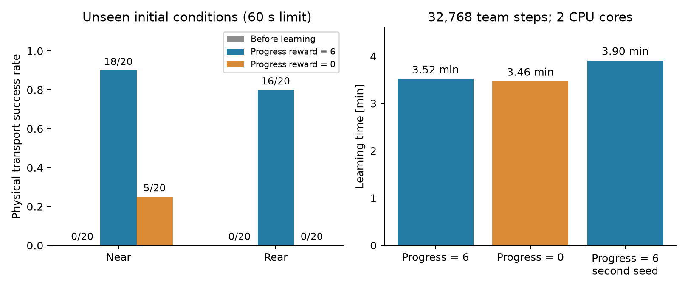

# 短時間で試すTorchRL MAPPOの運搬課題

学生用ノートブックの標準を、**2台・近い配置から後方配置への2段階・1条件32,768チームステップ**にしました。進捗報酬の有無を比較し、両条件で同じ初期重み・学習seed・学習量を使います。学習はランダムな重みから開始し、デモ動画・教師の行動は使いません。

## 課題の範囲

斜めのTに対して2台が向きを変えて押す位置へ整列し、共通の学習済み方策に切り替えて脚でTを約2 m運搬します。目標方向に対するTの初期角度は±15°、ロボット位置の揺らぎは4 cmです。近い配置から始め、検証で成功率75%以上に達すると後方配置へ進みます。検証は25ロールアウトごと、各段階で最低50ロールアウト行います。

今回新しく学ぶのは**押す位置までの移動と整列**です。歩行と、整列後にTを押す方策は固定しています。大きく前方へ回り込む配置、押す方策自体の再学習、3〜4台での協調は追加研究に分けます。この短時間実験だけで、それらの性能を保証することはできません。

## 実測した学習時間

2026年10月7日、AMD EPYC 7282上で各学習プロセスを**2 CPUコア**に限定して実行しました。PyTorchの計算スレッドは1、物理環境は2並列です。GPUは使っていません。

| 条件 | 学習量 | 学習時間 | 初期化 | 速度 |
|---|---:|---:|---:|---:|
| 進捗報酬あり、seed 20261008 | 32,768 | 3分31秒 | 4.4秒 | 155チームステップ/秒 |
| 進捗報酬なし、同じseed | 32,768 | 3分28秒 | 4.4秒 | 158チームステップ/秒 |
| 進捗報酬あり、seed 20261009 | 32,768 | 3分54秒 | 4.4秒 | 140チームステップ/秒 |

学習時間には、教材で実行する段階移行の検証とcheckpoint保存を含みます。開発中に追加した途中モデルの診断評価は別集計で、上の値には含めていません。診断も含む実験全体では、最初の2条件はそれぞれ5分9秒、5分16秒でした。

主要設定は収集長128、1回の収集256チームステップ、ミニバッチ128、更新4エポック、学習率`1e-4`です。小さいミニバッチと大きい学習率の試行では、途中で成功しても最後まで維持できなかったため、最後のモデルが成功する設定を採用しました。

2条件の学習部分は合計約7分です。インストール・歩行APIの確認・評価・動画作成を含む教材全体の所要時間は下の実行記録を参照してください。**これはGoogleのホスト上のColab時間の実測ではありません。** CPUの割り当てやソフトウェア版で変わるため、Colabでは全体10〜20分程度を初期の見積もりとし、ノートブックが表示する実測値を確認します。

## ノートブック全体の実行確認

学生用の18個のPythonセルを省略せず、32,768ステップ×2条件で実行しました。2コアのローカルJupyterカーネルで、準備・歩行API・参考再生・学習・標準評価・7本の動画表示・ZIP保存まで**9分48秒**でした。NumPy 2.0.2、PyTorch 2.11.0+cpuを事前に読み込んだカーネルをそのまま使い、TorchRL 0.14.0で動作を確認しました。描画はOSMesaです。

これはGoogleのホスト上での実行ではなく、公開リポジトリの取得先をローカルのGit fixtureへ置き換えた検証です。Google側の初回通信・システムライブラリの導入時間は含みません。結果フォルダの移動後にモデルを読み込めることも確認しました。学習前後の動画は同じseedから生成しています。

## 未使用の初期条件で運搬を評価

学習・段階移行の検証とは別のseedを使い、近い配置・後方配置を各20試行、制限60秒で評価しました。比較したのは同じ32,768ステップ時点の**最後のモデル**で、テスト結果からモデルを選び直していません。

| 条件 | 近い配置 | 後方配置 |
|---|---:|---:|
| 学習前 | 0/20 | 0/20 |
| 進捗報酬あり | **18/20（90%）** | **16/20（80%）** |
| 進捗報酬なし | 5/20（25%） | 0/20 |

成功例の運搬時間は近い配置で17.6〜27.8秒、後方配置で19.0〜28.8秒でした。全120試行で胴体とTの接触・転倒はありませんでした。一方、押す段階ではロボット同士が接触しており、接触を避ける協調は今後の課題です。接触の詳細は評価JSONに残しています。

報酬ありは後方段階へ進み、報酬なしは近い段階にとどまりました。同じ段階移行のルールを使っていますが、学習中に経験した配置は異なります。この比較は**報酬と共通の段階移行ルールを組み合わせた結果**として解釈します。

別の学習seedでも、位置合わせの開発用検証は近い配置12/12、後方配置11/12でした。この追加seedには20試行の運搬評価を実施していません。卒論では学習seedを少なくとも3種類、各配置50試行程度へ増やし、平均とばらつきを報告してください。

## 再現に使う記録

[実験記録JSON](results/short_task_20261007.json)に設定・パッケージ版・使用コードのSHA256・学習時間・全120試行の評価・追加seedの位置合わせ検証を保存しました。学習重み`checkpoints/lesson_transport.pt`と押す方策`checkpoints/pusher.pt`のSHA256も記録しています。同梱するのは最後のモデルで、教材の参考再生にだけ使います。学生自身の学習はこの重みから初期化しません。

[学生用Colab](https://colab.research.google.com/github/hashimoto-robotics-lab/hexapod-transport-rl/blob/main/notebooks/hexapod_transport_rl_colab.ipynb)は普通のPythonセルでTorchRLの収集・GAE・MAPPO更新を実行します。結果フォルダには使用したコード・モデルのコピー、条件、途中checkpoint、CSV、評価JSON、図、動画が入り、最後にZIPとして保存できます。
